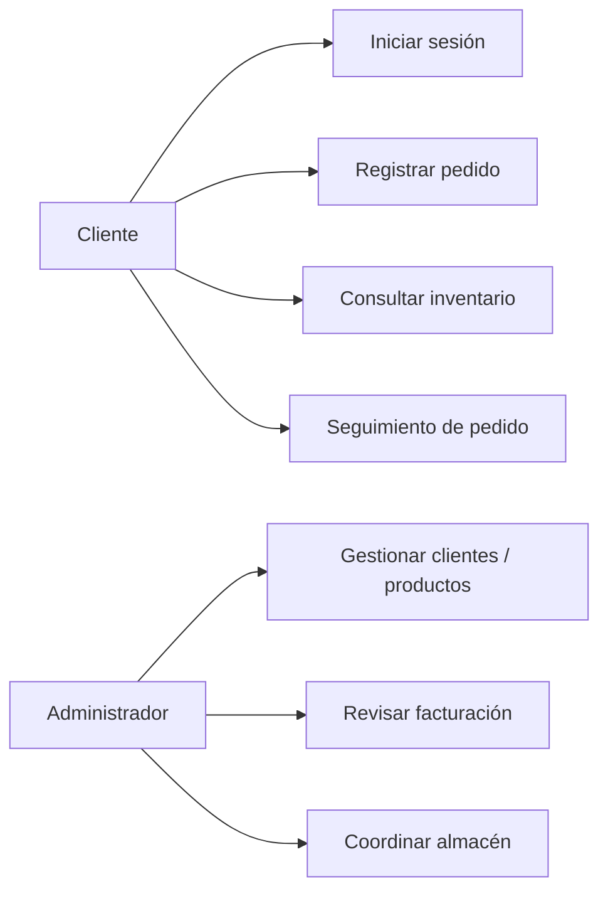
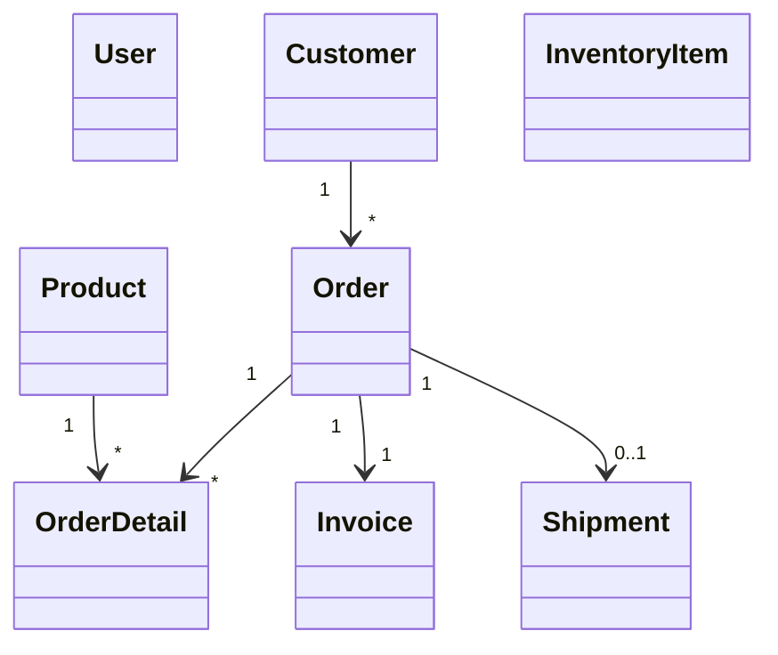
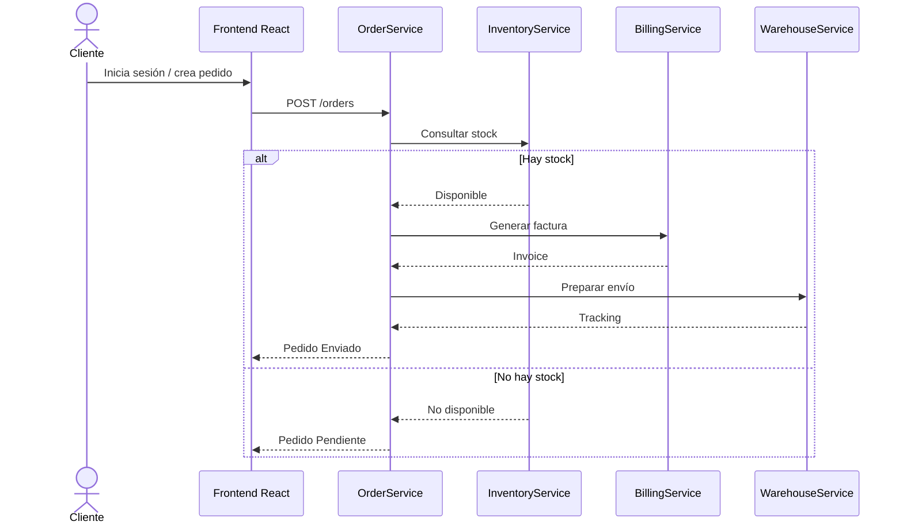
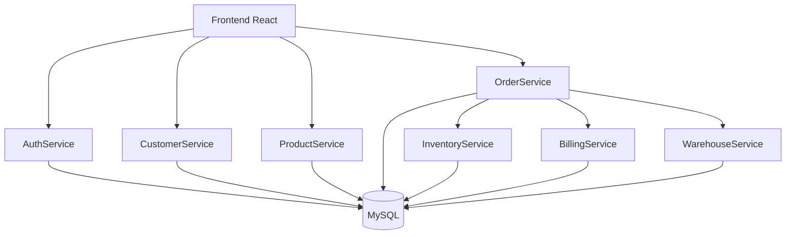

# Diagramas UML

## Casos de uso

```mermaid
flowchart LR
  U[Cliente] --> L[Iniciar sesión]
  U --> O[Registrar pedido]
  U --> C[Consultar inventario]
  U --> T[Seguimiento de pedido]
  A[Administrador] --> M[Gestionar clientes / productos]
  A --> I[Revisar facturación]
  A --> W[Coordinar almacén]
```

## Clases

```mermaid
classDiagram
  class User
  class Customer
  class Product
  class Order
  class OrderDetail
  class InventoryItem
  class Invoice
  class Shipment

  Order "1" --> "*" OrderDetail
  Product "1" --> "*" OrderDetail
  Customer "1" --> "*" Order
  Order "1" --> "1" Invoice
  Order "1" --> "0..1" Shipment
```

## Secuencia

```mermaid
sequenceDiagram
  actor Cliente
  participant React as Frontend React
  participant Order as OrderService
  participant Inventory as InventoryService
  participant Billing as BillingService
  participant Warehouse as WarehouseService

  Cliente->>React: Inicia sesión / crea pedido
  React->>Order: POST /orders
  Order->>Inventory: Consultar stock
  alt Hay stock
    Inventory-->>Order: Disponible
    Order->>Billing: Generar factura
    Billing-->>Order: Invoice
    Order->>Warehouse: Preparar envío
    Warehouse-->>Order: Tracking
    Order-->>React: Pedido Enviado
  else No hay stock
    Inventory-->>Order: No disponible
    Order-->>React: Pedido Pendiente
  end
```

## Componentes

```mermaid
flowchart TB
  FE[Frontend React]
  A[AuthService]
  C[CustomerService]
  P[ProductService]
  O[OrderService]
  I[InventoryService]
  B[BillingService]
  W[WarehouseService]
  DB[(MySQL)]

  FE --> A
  FE --> C
  FE --> P
  FE --> O
  O --> I
  O --> B
  O --> W
  A --> DB
  C --> DB
  P --> DB
  O --> DB
  I --> DB
  B --> DB
  W --> DB
```

